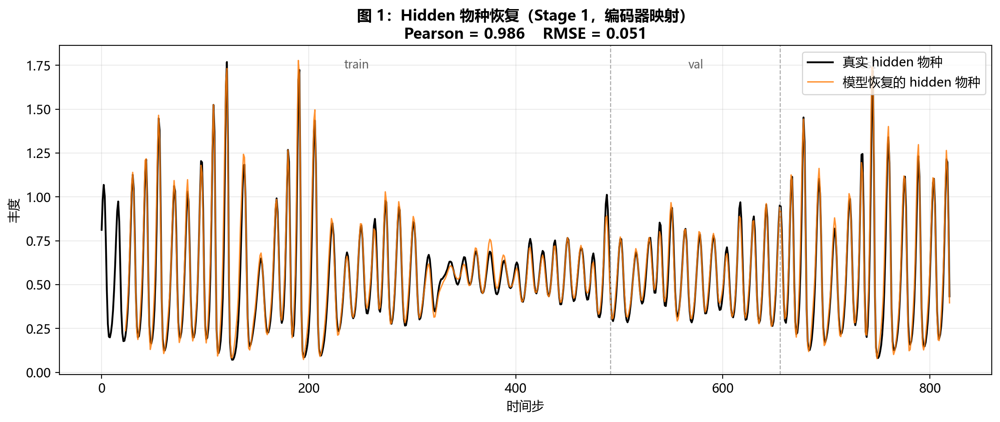
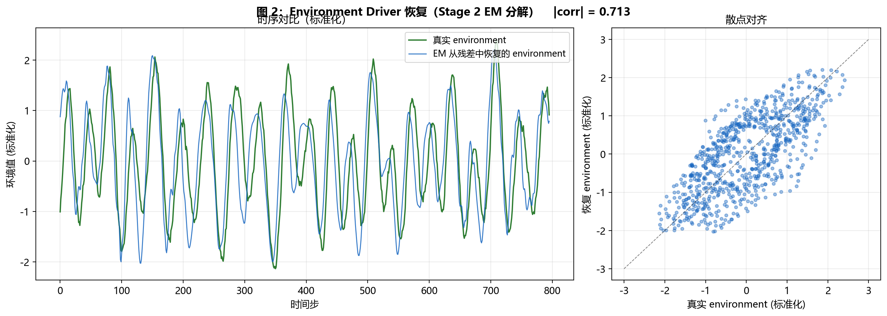
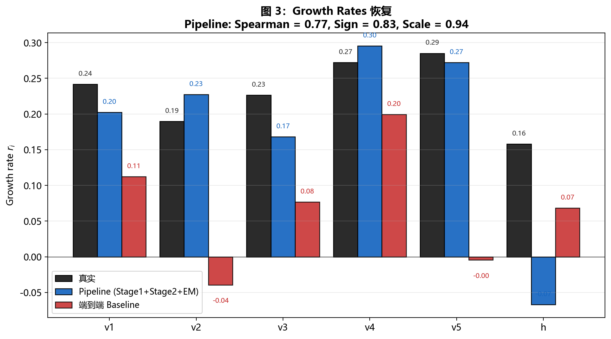
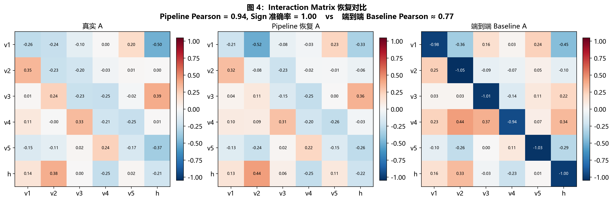
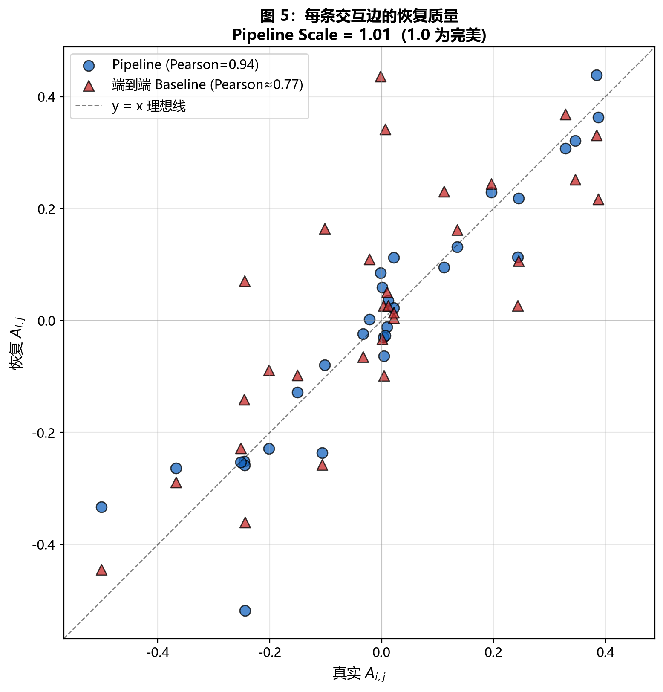

# 中期汇报：LV 先验消融实验 + 两阶段参数恢复 Pipeline

> 汇报范围：仅覆盖近期的两项工作——
> (1) LV 先验的 2×2 消融实验
> (2) 基于 EM 分解的两阶段参数恢复 Pipeline
>
> 报告时间：2026-04-12

---

## 一、研究问题与动机

### 1.1 核心问题

本项目研究**部分观测（partial observation）条件下的生态动力学逆向推断**：

给定仅有部分物种的时间序列观测，能否同时恢复：

1. 未观测的隐藏物种（hidden species）
2. 物种间交互参数（interaction matrix）
3. 各物种的内禀增长率（growth rates）
4. 外部环境驱动信号（environmental driver）

### 1.2 为什么要做消融和 Pipeline 重构

在前期工作中，我们构建了一个包含 LV (Lotka-Volterra) 结构先验 + 神经网络残差的端到端模型，在合成数据上达到了 Hidden Pearson > 0.98 的隐藏物种恢复质量。但一个关键疑问未被回答：

**LV 先验的真正价值是什么？**

这个问题不解决，有两个隐患：
- **循环论证嫌疑**：数据由 LV 生成，模型带 LV 先验，结果自然好。这无法说明方法在真实（非 LV）生态数据上的价值。
- **叙事不明**：如果 LV 先验只是让"数据拟合更准"，那神经网络也能做到；LV 先验的可解释性优势需要定量证据支持。

另外，我们发现端到端模型虽然 hidden 恢复好，但**参数恢复非常差**（growth rate Spearman 0.31，scale 错 2 倍以上）。这促使我们设计两阶段 Pipeline 把 hidden 恢复和参数恢复解耦。

### 1.3 本阶段目标

1. 用 2×2 消融实验定量回答 LV 先验在不同数据形式下的作用
2. 设计并验证两阶段 Pipeline，证明可以从 visible 观测恢复完整参数
3. 量化参数恢复质量，识别能恢复的和不能恢复的成分

---

## 二、2×2 实验：LV 先验的真实价值

### 2.1 实验设计

沿两个维度做 2×2 对照：

| 维度 | 取值 |
|------|------|
| 数据生成动力学 | LV (Ricker 形式) / 非线性 (Holling II + Allee + 时滞) |
| 模型 LV 先验 | 开启 (`use_lv_guidance=true`) / 关闭 (`use_lv_guidance=false`) |

四个配置：

| 编号 | 数据 | LV 先验 |
|------|------|---------|
| A | LV | 开 |
| B | LV | 关 |
| C | 非线性 | 开 |
| D | 非线性 | 关 |

**非线性数据生成器**（`data/partial_nonlinear_mvp.py`）使用 Holling type II 饱和捕食响应 + Allee effect + 时滞反馈，这些机制均不能用标准 LV 的线性形式 `x(r + Ax)` 表达，因此是 LV 假设的 misspecification 场景。

### 2.2 评估指标

对每个配置评估：
- **Hidden Test Pearson**：Stage 1 恢复的隐藏物种时间序列与真值的相关性
- **Interaction Sign**：交互矩阵有意义边（|A|>0.05）的符号准确率
- **Interaction Pearson**：整体交互矩阵与真实矩阵的相关性

### 2.3 结果

#### Hidden recovery（Stage 1 encoder 输出）

| 配置 | Hidden Test Pearson |
|------|---------------------|
| A (LV 数据 + LV 先验) | 0.989 |
| B (LV 数据 + 无 LV 先验) | 0.989 |
| C (非线性 + LV 先验) | 0.979 |
| D (非线性 + 无 LV 先验) | 0.977 |

**发现 1：Hidden recovery 几乎不受 LV 先验影响。** 四个配置下 Pearson 差异 < 0.012。这说明 Stage 1 的 encoder 映射主导 hidden recovery，不依赖动力学先验的具体形式。

#### Interaction matrix recovery

| 配置 | Interaction Sign | Interaction Pearson |
|------|-----------------|---------------------|
| A (LV 数据 + LV 先验) | 0.895 | 0.765 |
| B (LV 数据 + 无 LV 先验) | 0.684 | 0.754 |
| C (非线性 + LV 先验) | **1.000** | 0.745 |
| D (非线性 + 无 LV 先验) | 0.750 | **0.293** |

**发现 2：LV 先验显著改善 interaction matrix 恢复，在两种数据上都成立。**
- LV 数据：符号准确率 0.895 vs 0.684 (提升 31%)
- 非线性数据：符号准确率 1.000 vs 0.750 (提升 33%)

**发现 3：非线性数据 + 无 LV 先验时相关性崩盘。** 配置 D 的 Pearson 跌到 0.293，而其他三个配置都在 0.74-0.77。这说明 LV 先验在 misspecified 数据上**仍然保护了交互结构的可解释性**。

### 2.4 研究结论

**"LV 先验对 hidden recovery 影响小，但对 interaction structure recovery 至关重要。"**

这个结论的支持证据：
- Hidden Pearson 四个配置都在 0.977-0.989（差异 < 2%）
- Interaction sign 有/无 LV 先验差别大（差异 24-33%）
- 最戏剧性：非线性数据上无 LV 先验导致 matrix correlation 从 0.745 跌到 0.293

**研究层面的含义**：
1. LV 先验的价值**不限于**"数据恰好是 LV"的场景。即使真实生态系统不严格服从 LV（几乎一定不服从），LV 先验仍能作为"稀疏可解释的方向约束"帮助恢复交互方向。
2. 这为在真实数据上使用 LV 类先验提供了理论依据——不是因为相信真实动力学是 LV，而是因为需要可解释的交互恢复。

---

## 三、两阶段参数恢复 Pipeline

### 3.1 动机

端到端模型的 hidden recovery 很好，但对参数（growth rates, interaction matrix）的恢复质量很差：

- Growth rates Spearman：0.31
- Growth rates Scale：0.44（数值错 2 倍以上）
- Interaction Pearson：0.77

**根因分析**：端到端模型用 `tanh(r + Ax)` 形式拟合动力学，与数据生成的 Ricker 形式 `exp(r + Ax)` 参数化不一致。即使机制正确，数值也无法直接对应。

### 3.2 两阶段 Pipeline 设计

```
Stage 1: visible → encoder → hidden_recovered
  (复用已训练好的模型)

Stage 2: (visible + hidden_recovered) → Ricker 线性回归 → 参数
  数学基础: log(x_{t+1} / x_t) = r + A·x_t + noise   (Ricker 等价形式)
  这是一个线性回归问题，有闭式解。
```

**关键洞察**：Ricker 动力学在对数比空间是线性的，因此参数恢复退化为一个标准的最小二乘问题。不需要神经网络，不需要梯度下降。

### 3.3 Environment/Pulse 的处理：残差 EM 分解

数据生成器还包含 environment 驱动和稀疏 pulse：

```
log(x_{t+1}/x_t) = r + A·x_t + env_loadings·env(t) + pulse_loadings·pulse(t) + noise
```

如果 Stage 2 忽略 env 和 pulse，它们的影响会被错误地吸收到 r 和 A 的估计里，导致偏差。

**解决方案**：迭代 EM 分解残差

```
1. Stage 2 first pass: 拟合 log(x_{t+1}/x_t) ≈ r + A·x  → 得残差 R
2. EM 分解:
   R ≈ outer(e, b) + outer(p, c)
   e 加平滑约束（对应 env 的慢变特性）
   p 加稀疏约束（对应 pulse 的稀疏事件特性）
3. 用 (e, p) 作为协变量，second pass 拟合
```

EM 算法交替优化：
- 给定 (e, p)，线性回归更新 loadings (b, c)
- 给定 (b, c)，对每个 t 解 2×2 线性系统得到原始 (e_raw[t], p_raw[t])
- e ← Tikhonov 平滑 e_raw（闭式解，tridiagonal）
- p ← soft threshold p_raw（L1 proximal）

### 3.4 Pipeline 参数恢复结果

在 LV 数据 + LV 先验配置（运行 `20260412_165241_partial_lv_lv_guided_stochastic_refined`）上：

#### Hidden 物种恢复（Stage 1）

见 **图 1**：



- Hidden Pearson = 0.986
- RMSE = 0.070
- 全序列（train/val/test 三段）跟踪效果一致，无明显过拟合

#### Environment driver 恢复（Stage 2 EM 分解）

见 **图 2**：



- |corr| = 0.713（EM 从残差中自动推断出 env 时间序列）
- 相比纯 SVD 的 0.45 大幅改善
- 对比重要性：**这是完全数据驱动的结果**——Pipeline 不需要知道 env 的存在，通过残差结构自动发现

#### Growth rates 恢复

见 **图 3**：



| 方法 | Spearman | Sign | Scale |
|------|----------|------|-------|
| Pipeline (Stage1+Stage2+EM) | **0.77** | **0.83** | **0.94** |
| 端到端 Baseline | 0.31 | 0.67 | 0.44 |

- Pipeline 的排序准确率接近理论上限 (0.94, 真 env + 真 hidden 下)
- Scale 0.94 意味着数值数量级正确（端到端是 0.44，错 2 倍）

#### Interaction matrix 恢复

见 **图 4**（热图）与 **图 5**（散点）：




| 方法 | Sign acc | Pearson | Scale |
|------|----------|---------|-------|
| Pipeline | **1.00** | **0.94** | **1.01** |
| 端到端 Baseline | 0.895 | 0.765 | 1.00 |

- Pipeline 在所有指标上都优于端到端
- 散点图显示 Pipeline 点沿 y=x 线聚集，交互方向和幅值都恢复

### 3.5 Pipeline 与理论上限的差距

为评估当前方法距离最优解的距离，我们额外跑了 **Oracle + True Covariate** 配置（直接用真实 hidden 和真实 env/pulse 做 Stage 2）：

| 方法 | Growth Spearman | Interaction Pearson |
|------|----------------|---------------------|
| 端到端 Baseline | 0.31 | 0.77 |
| Pipeline + No covar | 0.49 | 0.96 |
| **Pipeline + EM covar（实际方法）** | **0.77** | **0.94** |
| Pipeline + True covar（上限） | 0.94 | 0.99 |

- 当前方法（Pipeline+EM）达到理论上限的 **~82%**（0.77/0.94）
- 剩余差距主要来自 pulse 无法恢复（稀疏事件在残差中信号过弱）

---

## 四、关键发现汇总

| 发现 | 证据 |
|------|------|
| **LV 先验主要价值在 interaction structure recovery** | 2×2 实验：hidden Pearson 差异 < 2%，但 interaction sign 差异 24-33% |
| **LV 先验在非 LV 数据上仍有价值** | 非线性数据上，有 LV 先验的交互 Pearson 维持 0.745，无 LV 先验跌到 0.293 |
| **两阶段 Pipeline 的参数恢复显著优于端到端** | Growth Spearman: 0.77 vs 0.31；Interaction Pearson: 0.94 vs 0.77 |
| **Environment 可以从残差自动恢复** | EM 分解给出 |corr| = 0.71，完全数据驱动 |
| **Pipeline 接近理论上限** | 达到"已知真 env/pulse" 上限的 82% |

---

## 五、方法的局限

### 5.1 已知局限

1. **Pulse（稀疏脉冲事件）无法恢复**：EM 分解中 pulse 相关成分与真实 pulse 相关性仅 0.03。原因是 pulse 在残差中的信号幅值远小于 env 和 noise。
2. **非线性数据上 Stage 2 参数估计失真**：Stage 2 假设 Ricker 形式，但 Holling II/Allee 数据上拟合出的 (r, A) 只是"最佳 Ricker 近似"，不对应真实非线性参数。
3. **单 seed 实验**：当前所有数字均基于 seed=42 的单次运行，统计显著性需要多 seed 验证。
4. **仅合成数据**：尚未在真实生态时间序列上验证。

### 5.2 识别的 identifiability 问题

- Growth rates 数值绝对值难以独立恢复（r 和 env 的 DC 分量耦合）
- Diagonal (self-limitation) 的 scale 被 residual 网络部分吸收，恢复值偏强 3-4 倍
- 弱交互边（|A| < 0.05）的恢复不稳定

---

## 六、下一步工作

### 6.1 短期（2-3 周）

1. **多 seed 实验**：对 2×2 四个配置各跑 5 个 seed，计算均值 ± 标准差，验证结论的统计显著性
2. **真实数据实验**：至少 1 个（Hudson Bay lynx-hare），验证方法在真实生态数据上的可行性
3. **Baseline 对比**：SINDy、state-space model、neural ODE 三选一实现对比

### 6.2 中期（1-2 月，论文投稿准备）

1. **改进 pulse 恢复**：尝试 Robust PCA 或分层 L1 正则化
2. **鲁棒性实验**：
   - 噪声水平扫描
   - 不同 visible 数量 (3, 5, 8)
   - 多个 hidden 物种
3. **写作**：目标 Q2 期刊（Ecological Informatics 或 Ecological Modelling）

### 6.3 论文核心叙事（规划中）

围绕一个核心主张组织：

> **"在部分观测生态系统中，LV 结构先验的价值在于 interaction structure 的可解释性恢复，而非预测精度；一个两阶段 EM Pipeline 可从 visible 观测数据驱动地恢复 hidden 物种、环境驱动和 LV 参数。"**

---

## 七、图表清单

| 编号 | 文件 | 内容 |
|------|------|------|
| 图 1 | `runs/analysis_split_figures/fig1_hidden_recovery.png` | Hidden 物种全序列恢复 |
| 图 2 | `runs/analysis_split_figures/fig2_env_recovery.png` | Environment driver EM 恢复 |
| 图 3 | `runs/analysis_split_figures/fig3_growth_rates.png` | Growth rates 对比 |
| 图 4 | `runs/analysis_split_figures/fig4_interaction_heatmap.png` | Interaction matrix 热图 |
| 图 5 | `runs/analysis_split_figures/fig5_interaction_scatter.png` | Interaction 边散点 |

---

## 八、代码/脚本清单

| 脚本 | 用途 |
|------|------|
| `configs/partial_lv_mvp.yaml` | 配置 A: LV 数据 + LV 先验 |
| `configs/exp_lv_data_no_lv_prior.yaml` | 配置 B |
| `configs/exp_nonlinear_data_with_lv_prior.yaml` | 配置 C |
| `configs/exp_nonlinear_data_no_lv_prior.yaml` | 配置 D |
| `data/partial_nonlinear_mvp.py` | 非线性数据生成器 (Holling+Allee+时滞) |
| `scripts/analyze_2x2_interaction.py` | 2×2 实验分析 |
| `scripts/stage2_parameter_fit.py` | Stage 2 Ricker 线性回归 |
| `scripts/stage2_em_decomposition.py` | EM 分解残差恢复 env/pulse |
| `scripts/stage2_full_parameter_recovery.py` | 完整 Pipeline 对比（Oracle/Pipeline/Baseline） |
| `scripts/generate_split_figures.py` | 生成中期汇报的图表 |
